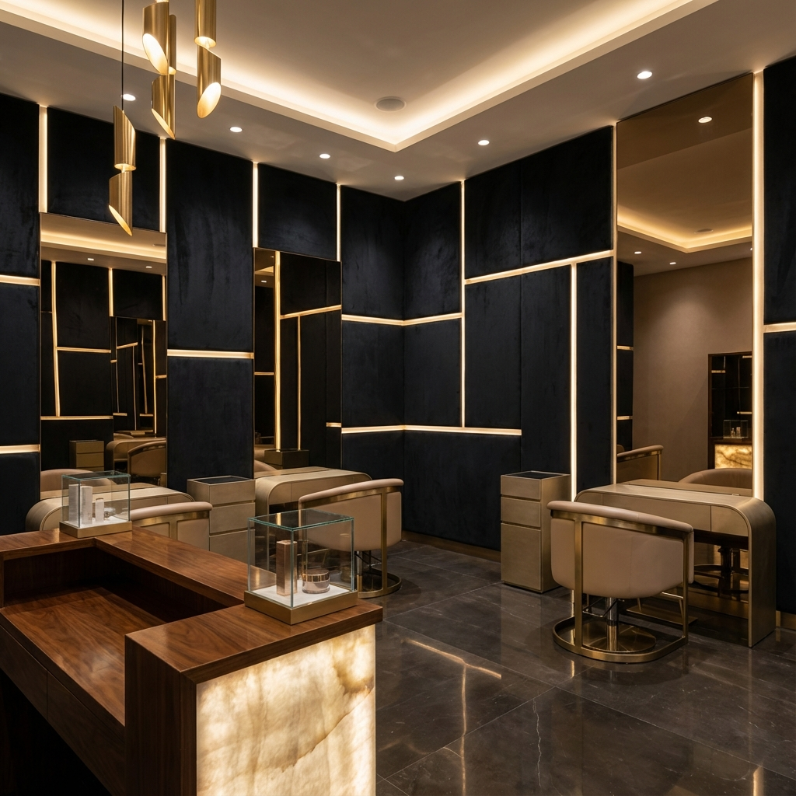

# Velvet Family Salon 💇‍♀️

A futuristic, mobile-first appointment booking website for a premium unisex salon in Shivamogga, Karnataka.



## ✨ Features

### User Features
- **📱 Mobile-First Design** - App-like experience with bottom navigation
- **📅 Easy Booking** - Book appointments in under 60 seconds
- **🔍 Service Discovery** - Browse by Men/Women/Unisex categories
- **📍 Location & Contact** - Google Maps, WhatsApp, and call integration
- **📖 Booking History** - Track upcoming and past appointments
- **🌙 Dark/Light Mode** - Automatic theme based on system preference

### Admin Features
- **📊 Dashboard** - Today's bookings and revenue overview
- **✂️ Service Management** - Add, edit, activate/deactivate services
- **👥 Staff Management** - Manage staff availability and schedules
- **📋 Booking Management** - Confirm, cancel, and complete appointments
- **📤 Export** - Download bookings as CSV

## 🛠️ Tech Stack

- **Frontend**: Next.js 15, React 18, TypeScript
- **Styling**: Tailwind CSS with custom theme
- **Animations**: Framer Motion
- **Icons**: Lucide React
- **Backend**: Supabase (PostgreSQL + Auth + Real-time)
- **Deployment**: Vercel

## 🚀 Getting Started

### Prerequisites
- Node.js 18+
- npm or yarn
- Supabase account (free tier works)

### Installation

1. **Clone and install dependencies**
   ```bash
   cd "Velvet Family Salon"
   npm install
   ```

2. **Set up Supabase**
   - Create a new project at [supabase.com](https://supabase.com)
   - Go to SQL Editor and run the schema in `supabase/schema.sql`
   - Copy your project URL and anon key

3. **Configure environment**
   ```bash
   cp .env.local.example .env.local
   ```
   Edit `.env.local` and add your Supabase credentials:
   ```
   NEXT_PUBLIC_SUPABASE_URL=your_project_url
   NEXT_PUBLIC_SUPABASE_ANON_KEY=your_anon_key
   ```

4. **Run the development server**
   ```bash
   npm run dev
   ```

5. **Open in browser**
   - User site: [http://localhost:3000](http://localhost:3000)
   - Admin panel: [http://localhost:3000/admin](http://localhost:3000/admin)
   
   Demo credentials: `admin@velvet.com` / `admin123`

## 📁 Project Structure

```
src/
├── app/                    # Next.js App Router pages
│   ├── page.tsx           # Home page
│   ├── services/          # Services listing
│   ├── book/              # Booking flow
│   ├── history/           # Booking history
│   ├── contact/           # Contact & map
│   ├── about/             # About salon
│   ├── menu/              # More options
│   └── admin/             # Admin panel
│       ├── dashboard/     # Admin dashboard
│       ├── services/      # Manage services
│       ├── bookings/      # Manage bookings
│       └── staff/         # Manage staff
├── components/
│   ├── layout/            # BottomNav, Header
│   ├── providers/         # ThemeProvider
│   └── ui/                # ServiceCard, QuickActions
├── lib/
│   ├── supabase/          # Supabase client setup
│   ├── types.ts           # TypeScript interfaces
│   ├── utils.ts           # Helper functions
│   └── mockData.ts        # Development mock data
└── public/
    └── images/            # AI-generated salon images
```

## 🎨 Design System

### Colors
- **Velvet Black**: `#1a1a1a` - Primary dark
- **Soft Beige**: `#f5f0e8` - Light background
- **Gold**: `#d4af37` - Accent color

### Typography
- **Outfit** - Body text
- **Playfair Display** - Display headings

## 🚢 Deployment

### Deploy to Vercel

1. Push to GitHub
2. Import in [vercel.com](https://vercel.com)
3. Add environment variables:
   - `NEXT_PUBLIC_SUPABASE_URL`
   - `NEXT_PUBLIC_SUPABASE_ANON_KEY`
4. Deploy!

### Production Checklist
- [ ] Replace demo admin credentials with Supabase Auth
- [ ] Update salon phone/WhatsApp numbers in `.env.local`
- [ ] Configure Google Maps API key for better map experience
- [ ] Set up WhatsApp Business for automated confirmations
- [ ] Add real salon images (or keep AI-generated ones)

## 📱 Mobile App (Future)

The backend is designed for easy mobile app integration:
- RESTful API through Supabase
- CORS headers configured
- Real-time subscriptions for live updates
- Authentication ready for mobile SDK

## 📄 License

MIT License - Feel free to use for your salon!

---

Built with ❤️ for **Velvet Family Salon**, Shivamogga
